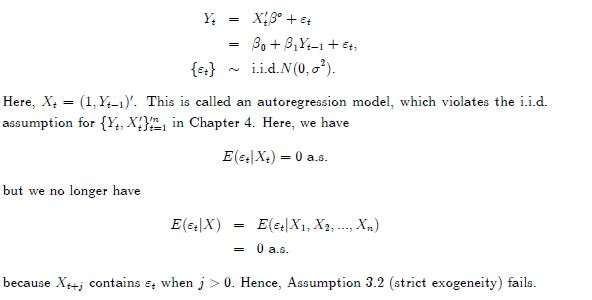
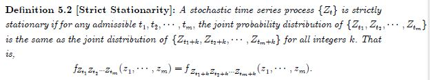
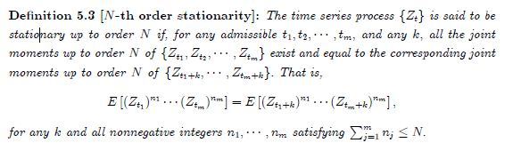
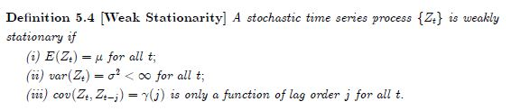
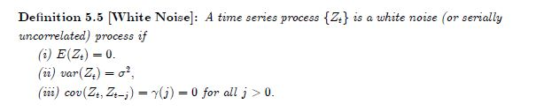
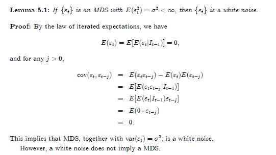
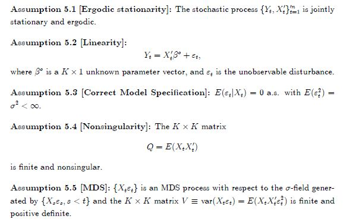
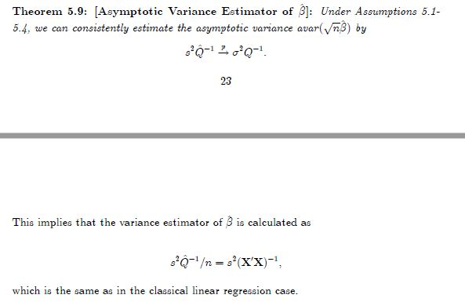
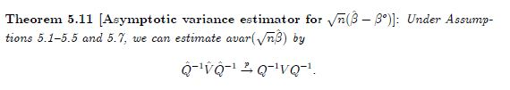
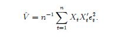

# LINEAR REGRESSION MODELS WITH DEPENDENT OBSERVATIONS

## Introduction to Time Series Analysis

- autoregression model

  

- Stationarity

  - strictly stationarity

  

  a strictly stationary process may not have finite moments.

  However,if moments and cross-moments of $${Z_t}$$exist, then they
  are time-invariant when $${Z_t}$$ is strictly stationary.

  - [N-th order stationarity]

  

  - [Weak Stationarity]

    

  - [White Noise]

    

    

    

    

    

    

    **关系：**

    

    ​

    

    

    

    

## Framework and Assumptions

- assumptions

- Consistency of OLS

  与之前相同，唯一不同就是在应用LLN时，iid替换为by the WLLN for ergodic stationary processes.

- Asymptotic Normality of OLS

  与之前相同，唯一不同就是在应用CLT时，iid替换为By the CLT of stationary ergodic MDS processes

- Asymptotic Variance Estimator for OLS

  

  

  

  其他都一样，不同之处在于把iid替换成theWLLN for ergodic stationary processes和MDS

## Hypothesis Testing